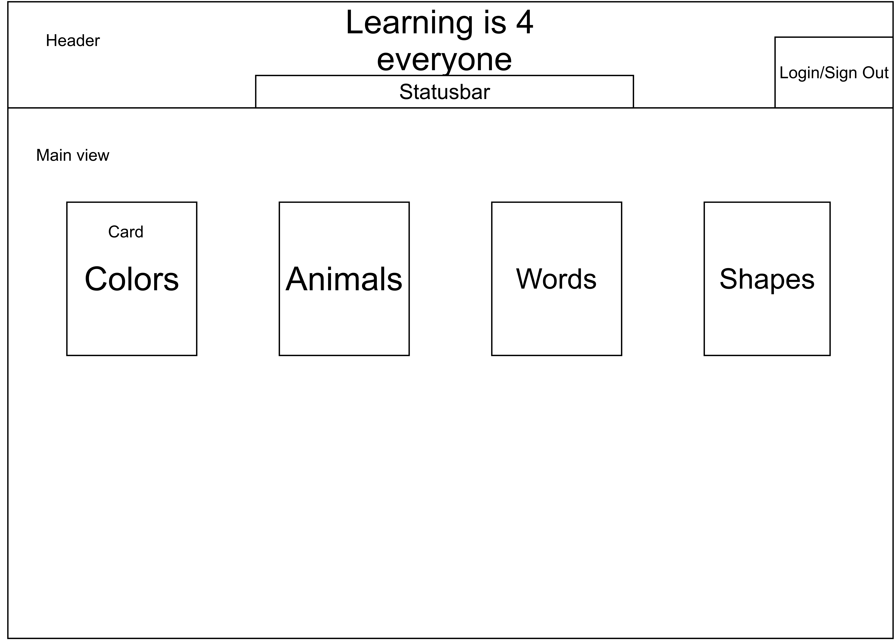

= LearningIs4Everyone
:toc:
:toc-placement:
:toclevels: 4
:icons: font
:sectnums:

Open source project with the ambition to offer interactive platform indepedent education to children from the day they are born

== Subjects
* Colors
* Animals
* Shapes
* Numbers
* ABC
* Vechicles
* Songs
* Fruits
* Vegetables
* Food

== Database structure
****
.Example structure

* Subject
** ID
** Name
** Language
** Country
** Living area
*** Land
*** Water
*** Desert
*** Forest
** Tag
** Gender
******************
Example object

[format="csv"]
[options="header",cols=",,s,,m"]
|===========================
Subject,ID,Name,Language,Country
Color,1,Red,eng,NULL
Animal,1,Tiger,eng,India
|===========================

******************

****

[id="frontpage_layout_and_logic"]
== Frontpage

.Frontpage overview

Figure 1 shows the desired or visionary layout for the frontpage

=== Layout

.Header
* Name of the webapp = *"Learning is 4 everyone"*
* Login/Sign out - Button showing *Login* when not logged in and and 
*Sign out* when the user is logged in.

* Statusbar - Showing the users current level/exp when logged in

.Main view 
* Subject *titles* available in the *database* should be displayed as *cards* on the front page

=== TODO

.Desired actions
* When clicking *webappname* the user should get back to *frontpage*
* When clicking a *card* the *subjects view page* should be displayed on *Main view*

.Functions
* he 